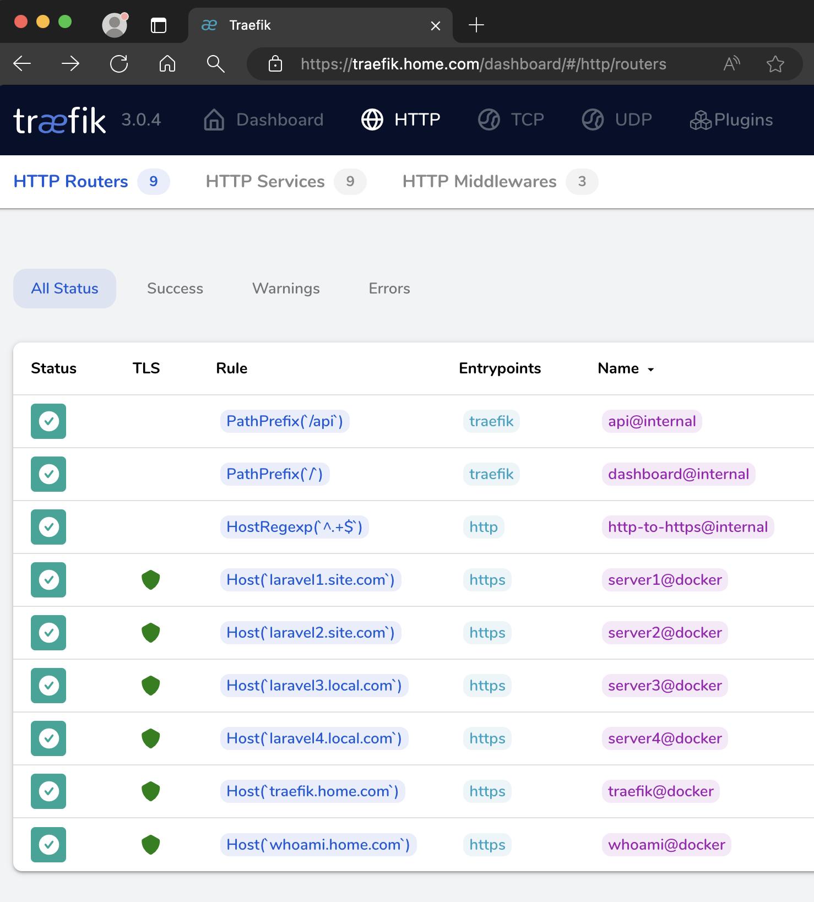
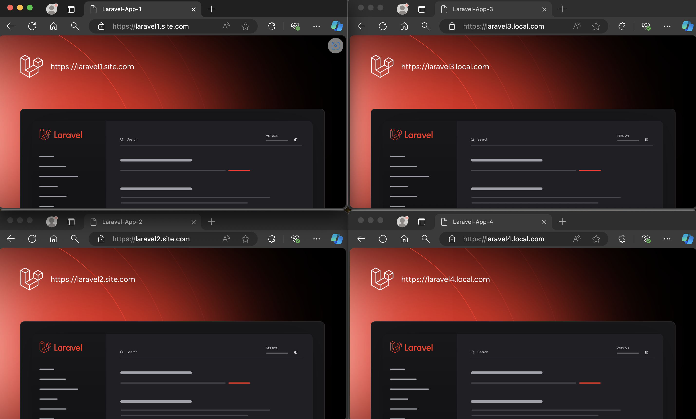

# Setting Up Traefik and mkcert for Local Development

Traefik is a powerful HTTP reverse proxy and load balancer that simplifies the deployment of microservices. While it's widely used in production environments, Traefik is also incredibly useful for local development. When combined with mkcert, a tool for creating locally trusted development certificates, you can create a seamless, secure development environment that mirrors production settings.

In this guide, we'll walk through setting up Traefik and mkcert for local development, focusing on the most relevant features and common issues, such as using APIs or third-party services that require HTTPS.

## Prerequisites

Before starting, ensure you have the following installed on your machine:

1. **Docker**: To containerize your applications.
2. **Docker Compose**: To manage multi-container Docker applications.
3. **External Network**: Create an external Docker network to connect all your services.
You can create the external network with the following command:

```sh
docker network create web
```

> Note: Creating an external network allows you to connect multiple Docker Compose projects to the same network. This way, you don't need to have all your containers in a single docker-compose.yml file or in the same directory. It enables you to use Traefik as a proxy across multiple projects seamlessly.

## Why Use Traefik and mkcert for Local Development?

There are several key benefits to using Traefik and mkcert together:

1. **Simplified Configuration**: Traefik provides an easy way to configure routing rules and manage traffic, using dynamic configuration files that can be updated without restarting the server.

2. **Automatic HTTPS with mkcert**: mkcert generates locally trusted SSL certificates for custom domain names, allowing you to work with HTTPS connections in your local environment without warnings or errors.

3. **Custom Domain Names**: Traefik allows you to define custom domain names for your services, making it easier to manage multiple projects locally.

4. **Load Balancing**: Traefik can distribute traffic among multiple instances of a service, providing load balancing for your applications.

5. **Middleware Support**: Traefik supports middleware plugins that can modify requests and responses, add authentication, rate limiting, and other features.

By using Traefik and mkcert, you can create a local development environment that handles multiple services, ensures secure HTTPS connections, and mimics production conditions.

## Common Issues Addressed

- **APIs and Third-Party Services**: Many APIs and third-party services require HTTPS. Without a proper SSL setup, you may encounter errors when integrating these services locally.
- **Domain Conflicts**: Using custom domain names with Traefik helps avoid conflicts between services running on different ports.
- **Security Warnings**: Browsers often show security warnings for self-signed certificates. mkcert creates certificates trusted by your local machine, eliminating these warnings.

## Setting Up Your Environment

This guide describes how to configure your environment to use Traefik as a reverse proxy with HTTPS connections. Ensure you have `docker-compose` installed to execute the following steps.

### Quick Start

A Makefile can simplify the setup process. You can run the following command from the root directory to install all dependencies and start the services:

```sh
make install
```

Alternatively, you can install each component individually by navigating to each service directory and running `make install`.

## Configuration Files

#### `docker-compose.yml`

To set up Traefik and mkcert in your `docker-compose.yml`, include the following configuration:

```yaml
services:
  mkcert:
    environment:
      - domain=*.home.com,*.site.com,*.local.com
    container_name: mkcert
    volumes:
        - ./certs/:/root/.local/share/mkcert
    image: vishnunair/docker-mkcert
    labels:
      - "traefik.enable=false"
    networks:
      - web

  traefik:
    image: traefik:latest
    container_name: traefik
    ports:
      - "80:80"
      - "443:443"
      - "8080:8080"
    volumes:
      - "/var/run/docker.sock:/var/run/docker.sock:ro"
      - "./config/traefik.yml:/etc/traefik/traefik.yml:ro"
      - "./config/dynamic.yml:/etc/traefik/dynamic.yml:ro"
      - "./certs/:/etc/certs:ro"
    labels:
      - "traefik.enable=true"
      - "traefik.http.routers.traefik.rule=Host(`traefik.home.com`)"
      - "traefik.http.routers.traefik.entrypoints=https"
      - "traefik.http.routers.traefik.tls=true"
      - "traefik.http.routers.traefik.service=traefik@docker"
      - "traefik.http.services.traefik.loadbalancer.server.port=8080"
    networks:
      - web

networks:
  web:
    external: true
```

### traefik.yml

Traefik's main configuration file, `traefik.yml`, should include the following:

```yaml
global:
  sendAnonymousUsage: false

api:
  dashboard: true
  insecure: true

providers:
  docker:
    endpoint: "unix:///var/run/docker.sock"
    watch: true
    exposedByDefault: false

  file:
    filename: /etc/traefik/dynamic.yml
    watch: true

log:
  level: INFO
  format: common

entryPoints:
  http:
    address: ":80"
    http:
      redirections:
        entryPoint:
          to: https
          scheme: https
  https:
    address: ":443"
```

### dynamic.yml
Traefik's dynamic configuration file, `dynamic.yml`, should include the TLS certificate information:

```yaml
tls:
  certificates:
    - certFile: "/etc/certs/_wildcard.home.com.pem"
      keyFile: "/etc/certs/_wildcard.home.com-key.pem"

    - certFile: "/etc/certs/_wildcard.site.com.pem"
      keyFile: "/etc/certs/_wildcard.site.com-key.pem"

    - certFile: "/etc/certs/_wildcard.local.com.pem"
      keyFile: "/etc/certs/_wildcard.local.com-key.pem"
```

### Modify the Hosts File

To properly route the domains to your local environment, add the following entries to your `hosts` file:

```sh
127.0.0.1       traefik.home.com
127.0.0.1       whoami.home.com
127.0.0.1       laravel1.site.com
127.0.0.1       laravel2.site.com
127.0.0.1       laravel3.local.com
127.0.0.1       laravel4.local.com
```

### Add Certificates to Trusted Certificates Store

To avoid security warnings in your browser, you need to add the `.pem` certificate to your trusted certificates store.

- **On macOS**: Open the `.pem` file with Keychain Access and add it to your System or Login keychain. Make sure to mark the certificate as trusted.
- **On Windows**: Run `certutil -addstore -f "ROOT" example.com+1.pem` in the command line as an administrator.
- **On Linux**: The method to add trusted certificates may vary by distribution. A common approach is to copy the `.pem` file to `/usr/local/share/ca-certificates/` and then run `sudo update-ca-certificates`.







## Conclusion

By following these steps and configurations, you can effectively set up Traefik and mkcert to manage multiple services and secure HTTPS connections in your local development environment. This setup not only mimics a production environment but also ensures that you can seamlessly integrate third-party services and APIs that require HTTPS. With Traefik's powerful routing capabilities and mkcert's easy-to-use certificate generation, your local development process will be more efficient, secure, and organized.

Feel free to customize the configurations and explore additional features of Traefik to further enhance your development setup. Happy coding!